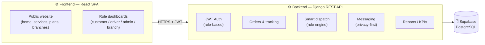

<div align="center">

# 🚚 SARO — Smart Delivery Management Platform

**A privacy-first, bilingual last-mile delivery platform built for the Saudi market.**

Rule-based smart dispatch · neighborhood smart lockers · PDPL-compliant messaging · real-time order tracking

[](https://www.djangoproject.com/)
[](https://www.django-rest-framework.org/)
[](https://react.dev/)
[](https://www.typescriptlang.org/)
[](https://vitejs.dev/)
[](https://tailwindcss.com/)
[](https://supabase.com/)
[](#-testing)
[](#-live-demo)

**🌐 [Live demo](https://valiant-magic-production-11d8.up.railway.app)** · [Features](#-features) · [Tech Stack](#-tech-stack) · [Architecture](#-architecture) · [Quick Start](#-quick-start) · [Deployment](DEPLOYMENT.md)

</div>

## 🌐 Live demo

| | URL |
|---|---|
| **App (frontend)** | https://valiant-magic-production-11d8.up.railway.app |
| **API (backend)** | https://saro-production-62b5.up.railway.app/api |

**Demo logins** (password `Passw0rd!23`): `admin1` · `branch1` · `driver1` · `customer1`

---

## 📖 Overview

**SARO** is a web platform for smart last-mile delivery, developed as an MIS senior project at
**Al Yamamah University** (2025–2026). It connects **customers, drivers, admins, and branch
supervisors** in one unified workflow and tackles the recurring pain points of traditional
delivery: inefficient dispatch, high cost, privacy exposure, and limited delivery flexibility.

The platform is **Arabic-first and fully bilingual (AR/EN with RTL)**, with an Aramex-inspired
tracking-first structure and its own navy brand identity.

> **Academic scope note:** smart dispatch is rule-based (simulated, not ML), and live National
> Address, real maps/GPS, payment gateways, and physical hardware are out of scope / simulated.

---

## ✨ Features

### By role

| Role | Capabilities |
|------|-------------|
| 🧑 **Customer** | Create orders, manage addresses, choose delivery method, track orders live, manage subscriptions, rate deliveries, message the driver |
| 🚗 **Driver** | View assigned deliveries, advance status (picked up → in transit → delivered), share locker pickup codes, follow over-the-wall instructions, report delays |
| 🛡️ **Admin** | Manage orders/users/branches/lockers/plans, KPI dashboard & charts, smart-dispatch driver assignment, delay monitoring |
| 🏢 **Branch supervisor** | Branch-scoped order management, locker oversight, local KPIs |

### Signature capabilities

- 🧠 **Rule-based smart dispatch** — ranks drivers by availability, location, workload, and priority, with explainable scores and a logged recommendation
- 📦 **Four delivery methods** — home delivery, neighborhood **smart locker** (with pickup code), home delivery box, and over-the-wall
- 🔒 **Privacy-first messaging** — in-platform customer ↔ driver chat that **never exposes phone numbers** (PDPL-aligned)
- 📍 **Live order tracking** — full status timeline with color-coded stages
- 🔔 **Notifications** — real-time bell with unread counts
- 🌐 **Bilingual & RTL** — instant Arabic ⇄ English switching across the whole UI
- 📊 **Analytics** — KPI cards and charts (orders by status/method, delays, ratings)

---

## 🛠 Tech Stack

| Layer | Technologies |
|-------|-------------|
| **Frontend** | Vite · React · TypeScript · Tailwind CSS · React Router · TanStack Query · i18next (AR/EN + RTL) · Recharts |
| **Backend** | Django 5.2 · Django REST Framework · SimpleJWT · django-cors-headers · WhiteNoise · Gunicorn |
| **Database** | Supabase (managed PostgreSQL) — Django owns the ORM & migrations |
| **Tooling** | Vitest-ready · Django test suite · ESLint/TSC · GitHub |

---

## 🏗 Architecture



**Backend apps:** `accounts`, `branches`, `addresses`, `lockers`, `orders`, `subscriptions`,
`payments`, `messaging`, `notifications`, `dispatch`, `reports`.

Design system & tokens: [`DESIGN.md`](DESIGN.md) · Build plan: [`PLAN.md`](PLAN.md) ·
Deployment: [`DEPLOYMENT.md`](DEPLOYMENT.md)

---

## 🚀 Quick Start

### Prerequisites
- Python 3.12+ · Node.js 18+ · (optional) a Supabase project — falls back to local SQLite if no `DATABASE_URL`

### 1. Backend
```powershell
cd backend
python -m venv .venv
.\.venv\Scripts\python.exe -m pip install -r requirements.txt
Copy-Item .env.example .env       # then set DATABASE_URL for Supabase (optional)
.\.venv\Scripts\python.exe manage.py migrate
.\.venv\Scripts\python.exe manage.py seed_demo   # optional demo data
.\.venv\Scripts\python.exe manage.py runserver
```
API → `http://127.0.0.1:8000/api` · Django admin → `/admin/`

### 2. Frontend
```powershell
cd frontend
npm install
Copy-Item .env.example .env       # set VITE_API_URL / Supabase keys
npm run dev
```
App → `http://localhost:5173`

### Demo accounts
After `seed_demo` (password `Passw0rd!23`): `admin1` · `branch1` · `driver1` · `driver2` · `customer1`

---

## 🧪 Testing

```powershell
cd backend
.\.venv\Scripts\python.exe manage.py test     # 7 functional tests (auth, order lifecycle,
                                              # permissions, dispatch) on in-memory SQLite
```

---

## 🗺 Roadmap

All phases complete — the platform is **launch-ready**.

- [x] **Phase 0** — Scaffold (backend, frontend, auth API, i18n/RTL shell)
- [x] **Phase 1** — Auth & role-based routing
- [x] **Phase 2** — Public website
- [x] **Phase 3** — Customer dashboard (orders, tracking, addresses, subscriptions, ratings)
- [x] **Phase 4** — Driver dashboard (status workflow, locker codes, delays)
- [x] **Phase 5** — Admin & branch dashboards (management + KPIs)
- [x] **Phase 6** — Smart dispatch engine
- [x] **Phase 7** — Messaging & notifications
- [x] **Phase 8** — Testing & launch prep

---

## 📁 Project Structure

```
SARO/
├── backend/                 # Django + DRF API
│   ├── config/              # settings, urls, wsgi
│   └── apps/                # accounts, orders, dispatch, messaging, …
├── frontend/                # Vite + React + TS app
│   └── src/
│       ├── pages/           # public site + role dashboards
│       ├── components/      # shared UI kit (icons, cards, modals)
│       ├── layouts/         # public & dashboard shells
│       ├── auth/            # context, route guards
│       └── lib/             # API client, types
├── PLAN.md · DESIGN.md · DEPLOYMENT.md · CLAUDE.md
```

---

## 👥 Team

Senior project — College of Business, **Al Yamamah University** (2025–2026)
Supervisor: **Dr. Abdullah AlSahly**

Abdulaziz BinAsakir · Meshari Alsharif · Abdullah Aref · Faisal Alrayes

---

## 📄 License

Developed for academic purposes as a university senior project.
© 2025–2026 SARO Team. All rights reserved.
