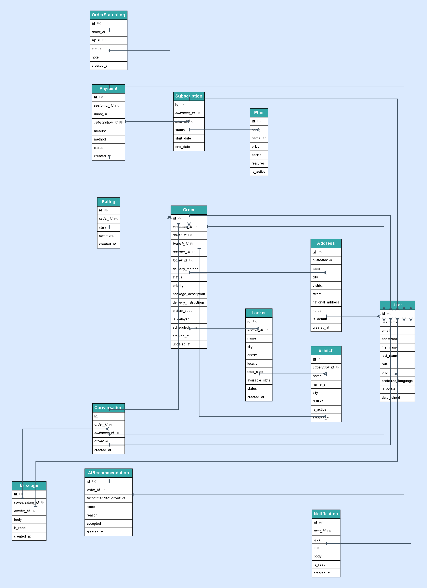
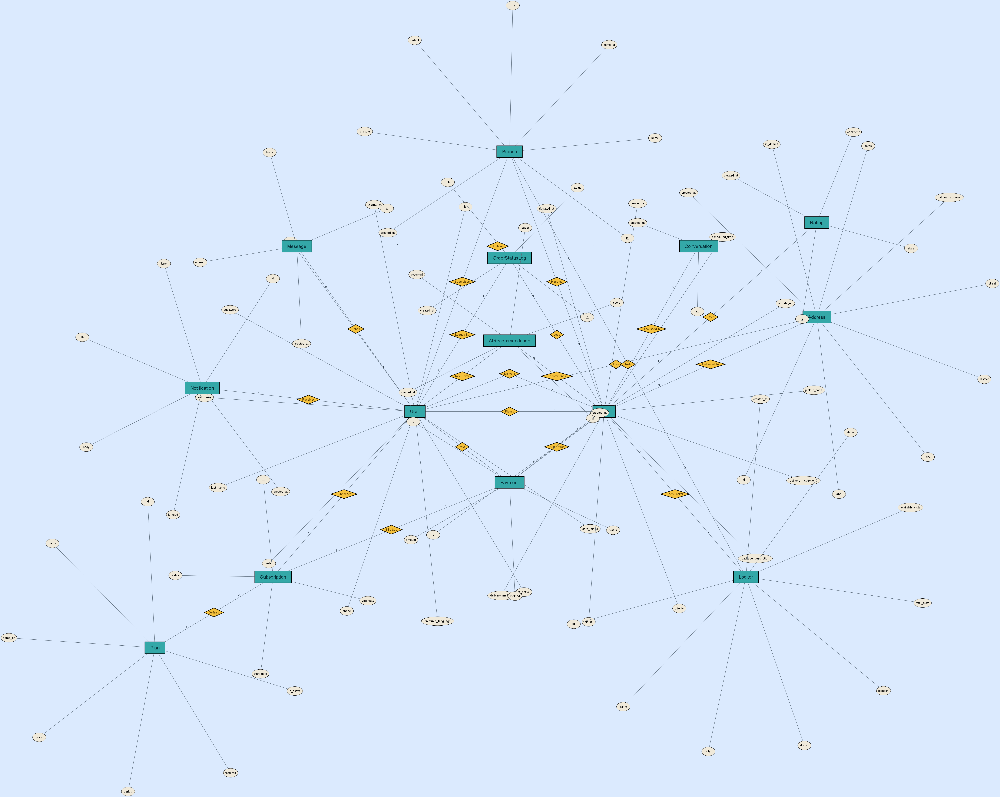
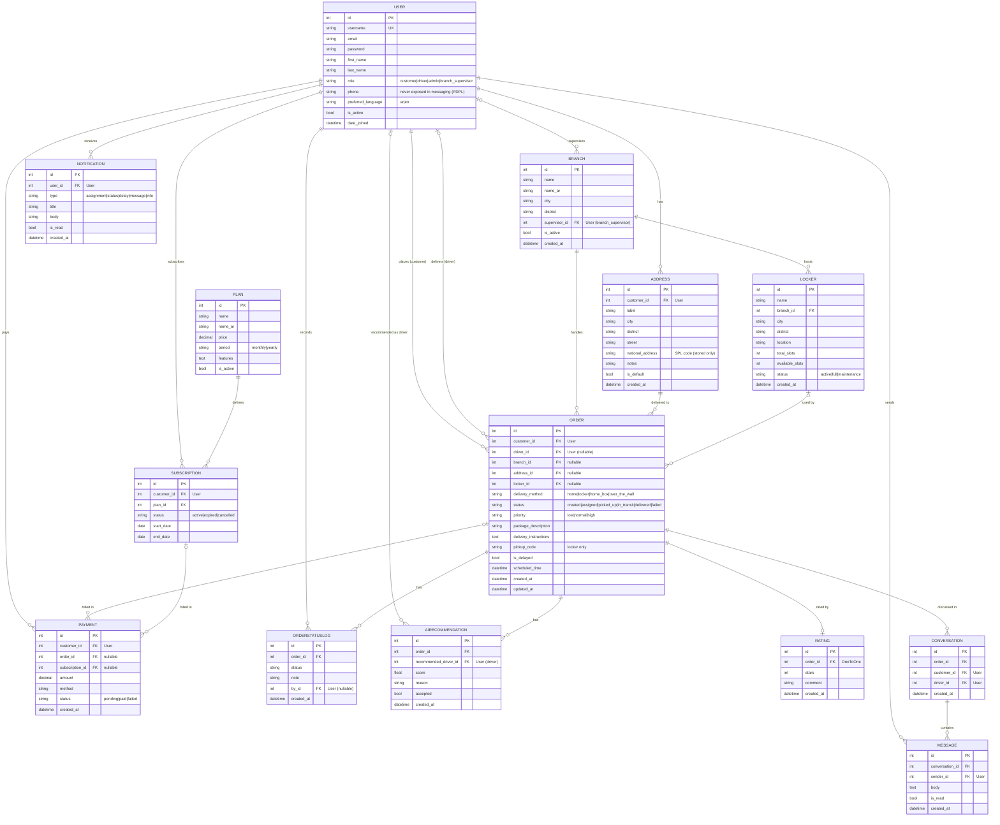

# SARO — Entity Relationship Diagram

This ERD reflects the actual implemented schema (Django models under `backend/apps/`).
SQL DDL: [`schema.mysql.sql`](schema.mysql.sql) (MySQL 8) — the production DB is PostgreSQL via Supabase.

## Clean schema diagram (crow's-foot — recommended)

Each entity is one box listing its columns (**PK** bold+underlined, *FK* italic);
connectors use crow's-foot ends (the "many" side) and `tee` (the "one" side).

> Generated with Graphviz from [`gen_erd_tables.py`](gen_erd_tables.py) —
> run `python docs/gen_erd_tables.py` to regenerate after schema changes.

## Chen-notation diagram (matches the classic example style)

Teal boxes = entities · cream ovals = attributes (underlined = primary key) ·
amber diamonds = relationships · edge labels = cardinality (1 / N).

> Generated from [`gen_erd.py`](gen_erd.py) — run `python docs/gen_erd.py` to regenerate.

## Crow's-foot version (Mermaid)

GitHub renders the Mermaid diagram below automatically. To edit/export, paste it into
<https://mermaid.live>.

> **Design note:** SARO uses **one `User` table with a `role` field**
> (`customer` · `driver` · `admin` · `branch_supervisor`) instead of separate
> Student/Admin tables. Role-specific links (customer, driver, branch supervisor)
> are therefore all relationships originating from `User`.

## Relationship summary

| From | To | Cardinality | Meaning |
|------|----|-------------|---------|
| User (customer) | Address | 1 : N | A customer saves many addresses |
| User (customer) | Order | 1 : N | A customer places many orders |
| User (driver) | Order | 0..1 : N | A driver delivers many orders (order may be unassigned) |
| User (branch_supervisor) | Branch | 0..1 : N | A supervisor oversees branches |
| Branch | Locker | 1 : N | A branch hosts many lockers |
| Branch | Order | 1 : N | A branch handles many orders |
| Address | Order | 1 : N | An address can be the target of many orders |
| Locker | Order | 0..1 : N | A locker can be used by many (locker) orders |
| Order | OrderStatusLog | 1 : N | Each status change is logged |
| Order | Rating | 1 : 0..1 | A delivered order can be rated once |
| Order | Conversation | 1 : N | Privacy-first chat tied to an order |
| Conversation | Message | 1 : N | Messages within a conversation |
| User | Message | 1 : N | A user sends many messages (no phone numbers exposed) |
| Plan | Subscription | 1 : N | A plan has many subscriptions |
| User (customer) | Subscription | 1 : N | A customer subscribes over time |
| User / Order / Subscription | Payment | 1 : N | Simulated payments link to a customer (+order or subscription) |
| Order | AIRecommendation | 1 : N | Smart-dispatch suggestions logged per order |
| User (driver) | AIRecommendation | 0..1 : N | A driver can be the recommended one |
| User | Notification | 1 : N | A user receives many notifications |

Crow's-foot legend: `||` = exactly one · `|o` = zero or one · `o{` = zero or many · `|{` = one or many.
